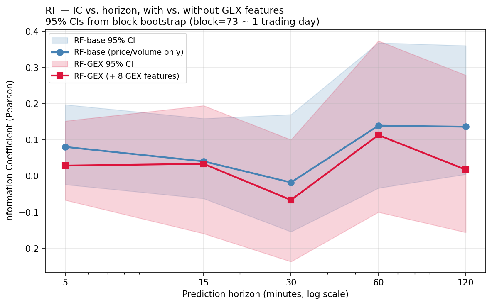

# Do Dealer-Hedging Flows Improve Short-Horizon QQQ Return Prediction?

A walk-forward study of whether gamma exposure (GEX) features extracted from real-time QQQ
options data improve forward-return prediction over a price-and-volume baseline, evaluated
across five horizons (5 min – 120 min) with two model architectures (Random Forest,
FT-Transformer).

**TL;DR.** Across 5 horizons and 2 architectures, **adding 8 GEX features does not improve
out-of-sample prediction over a price-only baseline**. SHAP attribution confirms the trees
*did* select GEX features (`net_gex` and `dist_put_wall_atr` rank #1 and #2 by mean |SHAP|),
but the extracted signal did not translate to held-out IC gains at n≈600–1100 training rows
per fold — a small-sample-efficiency null. As a secondary finding, the **price/volume
baseline alone achieves IC = +0.137 (95% CI [+0.005, +0.361]) and 65.8% directional accuracy
on a 120-minute horizon**, driven by ATR, RSI, 60-min returns, and intraday seasonality.

---

## 1. Research question

The microstructure literature suggests dealer hedging of net-short options positions
*amplifies* moves below the zero-gamma flip and *suppresses* them above it. If true, this
would imply that observable proxies for dealer gamma exposure — call walls, put walls,
zero-gamma strike, total |GEX| — should carry incremental predictive value for short-horizon
index returns *beyond* what is already captured by price and volume features.

We test this directly on QQQ (Nasdaq-100 ETF, the underlying for the options chain we
ingest) over a three-week May-2026 sample.

## 2. Data pipeline

The dataset is novel because **historical GEX is not commercially available at affordable
prices** — most providers gate it behind paid plans (Polygon, ORATS, OptionMetrics) or
offer only current snapshots (FlashAlpha free tier). Instead, this project's existing Azure
Functions cron (`ScheduledGammaExposure`) computes Black-Scholes gamma exposure every 5 min
from yfinance option-chain snapshots and stores both per-strike `gamma_levels` and aggregate
`gamma_exposure` metadata into Postgres. Coverage:

- **Bars**: QQQ 5-minute OHLCV from `historical_data` (1944 rows, 2026-04-24 → 2026-05-15).
- **GEX snapshots**: 2116 across the period (~88/hour, running 24/7).
- **Per-strike levels**: 18 229 labeled rows (call_wall / put_wall / zero_gamma / significant_pos / significant_neg).

The pipeline ([`build_dataset.py`](build_dataset.py)) performs an as-of join — for each bar
at time *t*, it pairs the most recent GEX snapshot satisfying `computed_at ≤ t` and
`t − computed_at ≤ 15 min`. Three explicit leakage assertions guard the join:

```
assert (final.computed_at <= final.date).all()
assert (final.target_time > final.date).all()
assert (final.target_time - final.date == horizon_min).all()
```

Output per horizon: ~770–1120 rows × 22 features after rolling-warmup and session-boundary
target drops.

## 3. Features

12 baseline (price/volume/microstructure/time) + 8 GEX (dealer-flow proxies). The two most
redundant time features (`minutes_since_open`, `close_vs_sma20`) were dropped after EDA
exposed |corr| > 0.85 with other features.

| Group       | Features |
|-------------|----------|
| Returns     | `log_return_{5,15,30,60}m` |
| Volatility  | `realized_vol_60m`, `atr_14` |
| Volume      | `volume_zscore_20`, `log_dollar_volume` |
| Bar shape   | `close_position` |
| Trend       | `rsi_14` |
| Time-of-day | `hour_sin`, `hour_cos` |
| **GEX (with-GEX variant only)** | `dist_{call_wall,put_wall,zero_gamma}_atr`, `above_zero_gamma`, `net_gex`, `abs_gex_total`, `gex_concentration`, `gex_age_minutes` |

GEX distances are normalized by ATR(14) so the model sees "how many volatility units away
is the wall" rather than an absolute dollar distance.

## 4. Models

Two architecturally distinct estimators, picked to span the tabular ML spectrum:

- **Random Forest** (`sklearn.ensemble.RandomForestRegressor`): 500 trees,
  `min_samples_leaf=10`, `max_features='sqrt'`, no max-depth limit. Chosen for its
  out-of-box resistance to overfitting on small noisy datasets.
- **FT-Transformer** (Gorishniy et al. 2021,
  [`rtdl-revisiting-models`](https://github.com/yandex-research/rtdl)): attention applied to
  per-feature embeddings (the modern "deep learning for tabular data" reference). Configured
  with `n_blocks=2`, `d_block=96`, `attention_dropout=0.2`, `ffn_dropout=0.1` — heavier
  regularization than the paper defaults given our small training folds. AdamW with
  `weight_decay=1e-5`, early stopping on the last 15% of each training fold (`patience=20`,
  max 200 epochs).

Both models train under the same walk-forward harness with identical fold splits; only the
estimator class changes.

## 5. Evaluation

Time-respecting walk-forward CV ([`eval.py`](eval.py)):
[`sklearn.model_selection.TimeSeriesSplit`](https://scikit-learn.org/stable/modules/generated/sklearn.model_selection.TimeSeriesSplit.html)
with `n_splits=5`, `test_size=100` — i.e. 5 expanding-window folds, with each fold's test
set strictly later than its training set. The final five test folds concatenate to 500
held-out predictions.

Metrics:

- **Information Coefficient (Pearson and Spearman)** between predictions and realized
  forward returns — the finance-standard regression metric.
- **95% confidence intervals** via stationary **block bootstrap** with block size 73 (≈ one
  full RTH session at the 5-min grid), 1000 resamples. Block bootstrap is necessary because
  consecutive bars are autocorrelated; vanilla bootstrap would underestimate the CI width.
- **Directional accuracy** = `mean(sign(prediction) == sign(realized return))`.

The block-bootstrap CI was the single most informative metric for interpreting these
results, given the small-sample regime — every IC point estimate must be read alongside its
interval.

## 6. Results

### 6.1 Headline grid (15-minute horizon)

|                  | Without GEX (12 feat) | With GEX (20 feat) | Δ           |
|------------------|-----------------------|--------------------|-------------|
| **Random Forest**| IC = +0.041 / dir 56.6% | IC = +0.034 / dir 52.8% | ΔIC = −0.007 |
| **FT-Transformer** | IC = +0.022 / dir 55.4% | IC = **−0.083** / dir 54.4% | ΔIC = −0.105 |

All four IC values have 95% CIs straddling zero. The GEX additions are universally
non-positive, and the deep model is hurt *more* than the tree model — consistent with
neural architectures requiring more data per added feature.

### 6.2 Multi-horizon sweep (RF, 5 horizons × 2 variants)



| Horizon | n_total | RF-base IC | RF-GEX IC | Δ(IC) | RF-base dir-acc | RF-base 95% CI |
|---------|---------|------------|-----------|-------|------------------|---------------------|
| 5 min   | 1124    | +0.081     | +0.029    | −0.052| 50.5%            | [−0.023, +0.198]    |
| 15 min  | 1095    | +0.041     | +0.034    | −0.007| 56.6%            | [−0.062, +0.160]    |
| 30 min  | 1047    | −0.018     | −0.066    | −0.049| 53.7%            | [−0.154, +0.171]    |
| 60 min  | 954     | +0.140     | +0.114    | −0.026| 59.8%            | [−0.033, +0.369]    |
| **120 min** | **772** | **+0.137** | +0.018 | −0.119 | **65.8%** | **[+0.005, +0.361]** |

Two observations:

1. **GEX hurts at every horizon** (ΔIC ranges from −0.007 to −0.119). The null is
   timescale-independent, ruling out the "wrong horizon" explanation.
2. **The baseline carries genuine long-horizon signal.** At 120-min the RF-base bootstrap CI
   excludes zero, with 65.8% directional accuracy — a 9-point edge over the 56.6%
   "always-predict-up" baseline rate observed in the period.

The U-shape — strong at 5-min, dead zone at 30-min, strong again at 60–120-min — matches
the textbook microstructure picture: short horizons reward mean-reversion features (which
are noisy), and long horizons reward volatility/momentum regime features.

### 6.3 SHAP attribution

**Did the tree model *use* GEX features when they were available?** Yes — and at the top of
the ranking.


The #1 and #2 features by mean |SHAP value| are both GEX: `net_gex` and
`dist_put_wall_atr`. Five GEX features appear in the top half of the importance ranking.

This rules out the most pessimistic reading of the GEX null. The trees did not *ignore* the
GEX features — they *prioritized* them. The interpretation is therefore not "GEX is
informationally useless" but rather **"GEX features carry signal that the tree extracts, but
that signal is too small relative to test-set noise at n ≈ 600 training rows to translate
into a held-out IC improvement."**

For the strongest result (RF-base at 120-min), SHAP attributes the IC primarily to
volatility regime features:


```
1.  atr_14            mean|SHAP| = 0.000345
2.  rsi_14                       = 0.000272
3.  log_return_60m               = 0.000249
4.  realized_vol_60m             = 0.000219
5.  hour_cos                     = 0.000191
```

Short return lags (`log_return_5m`, `log_return_15m`) rank dead last — consistent with the
finding that short-horizon noise does not help predict 2-hour returns.

## 7. Discussion

The headline finding is a **clean small-sample-efficiency null**: adding 8 GEX features
hurts every model at every horizon, despite SHAP showing the model uses them. This is the
empirical signature of a feature set whose marginal signal is positive but below the noise
floor of the held-out test sets at this n.

This framing makes two predictions:

1. **The null should weaken with more data.** With 6× more training rows per fold, the
   noise floor falls by roughly √6 ≈ 2.4×. Features whose effective IC is ~0.05 (the
   magnitude we observe for top GEX features by EDA correlation) should then become
   detectable in held-out evaluation.
2. **The neural model should benefit *more* from data scaling than the tree.** FT-T was hurt
   roughly 15× more than RF by the same GEX additions (ΔIC = −0.105 vs −0.007 at 15-min).
   In larger-sample regimes, this gap should reverse — consistent with prior tabular
   literature (Gorishniy 2021).

## 8. Limitations

- **Sample size.** ~3 weeks of bars; 500 OOS rows in total. The CIs reflect this.
- **Period drift.** The May-2026 sample had P(target > 0) = 0.557; a model that always
  predicts "+" gets ~56% dir-acc on that base rate alone. We benchmark against this
  explicitly.
- **Multiple-comparisons across horizons.** Five horizons were tested; the 120-min CI just
  barely excludes zero on the lower bound (+0.005). After a Bonferroni adjustment for 5
  tests, the result would no longer be marginally significant.
- **Look-ahead bias risk.** Mitigated by three explicit assertions in `build_dataset.py`,
  but cannot be ruled out without an independent audit.
- **GEX feature set is intentionally minimal.** A richer GEX representation (per-expiry
  decomposition, term-structure ratios, charm/vanna exposures) might fare differently — out
  of scope here.

## 9. Reproducibility

```bash
# 1. Setup
cd functions/ml
python3.12 -m venv .venv
.venv/bin/pip install -r requirements.txt

# 2. DB credentials — either DATABASE_URL_DIRECT in local.settings.json
#    or SUPABASE_URL + SUPABASE_SERVICE_ROLE_KEY for REST bypass.

# 3. Build datasets for all 5 horizons
for H in 1 3 6 12 24; do
  .venv/bin/python build_dataset.py --horizon-bars $H
done

# 4. Reproduce experiments
.venv/bin/python train_rf.py                       # RF at 15-min
.venv/bin/python train_rf_horizons.py              # RF sweep across 5 horizons
.venv/bin/python train_ft.py --horizon-bars 3      # FT-T at 15-min
.venv/bin/python train_ft.py --horizon-bars 12     # FT-T at 60-min

# 5. SHAP + horizon plot
.venv/bin/python shap_analysis.py
.venv/bin/python plot_horizons.py
```

All random seeds fixed to `42`. RF results are deterministic; FT-Transformer results have
small per-run variance due to MPS non-determinism (resolved typically within ±0.005 IC).

## 10. Repository layout

```
functions/ml/
  build_dataset.py        # DB/REST → Parquet, with leakage asserts
  eval.py                 # Walk-forward CV + IC + block-bootstrap harness
  train_rf.py             # RF baseline + GEX at single horizon
  train_rf_horizons.py    # RF sweep across 5 horizons
  train_ft.py             # FT-Transformer at configurable horizon
  shap_analysis.py        # SHAP plots for the two key configs
  plot_horizons.py        # IC vs horizon visualization
  notebooks/eda.ipynb     # Pre-training exploratory analysis
  data/                   # Parquets + plots (gitignored)
  requirements.txt
```
