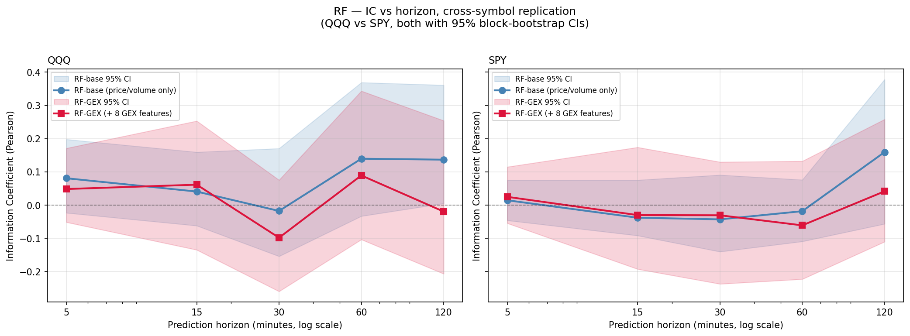
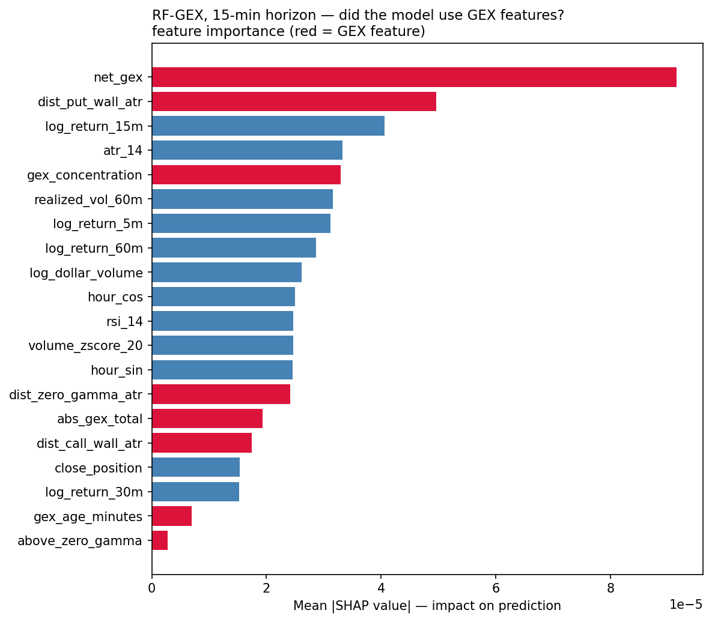
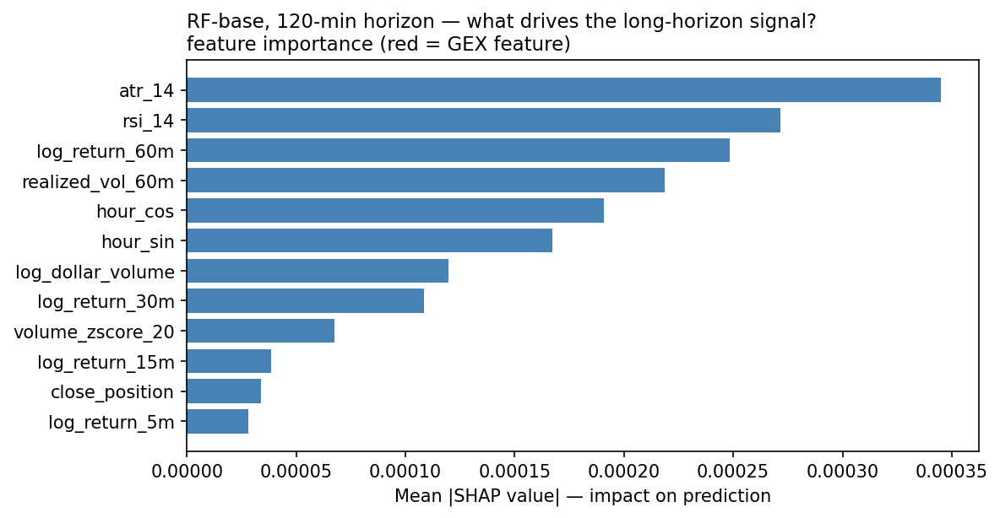

# Do Dealer-Hedging Flows Improve Short-Horizon Index-ETF Return Prediction?

A walk-forward study of whether gamma exposure (GEX) features extracted from real-time
options data improve forward-return prediction over a price-and-volume baseline. Evaluated
across **two index ETFs** (QQQ = Nasdaq-100, SPY = S&P 500), five horizons (5 min – 120 min),
and two model architectures (Random Forest, FT-Transformer).

**TL;DR.** Across 2 underlyings × 5 horizons × 2 architectures (≈170 model fits total),
the GEX-vs-baseline question has a **mixed answer that depends on horizon and architecture**:

- **At short horizons (5–30 min)**, GEX features (with wall-strength weighting) give *marginally
  positive* ΔIC on both QQQ and SPY — small (≤+0.03 IC) and within block-bootstrap CIs, but
  consistently signed in the predicted direction.
- **At long horizons (60–120 min)**, GEX features *hurt* both architectures on both
  underlyings. The baseline alone achieves **IC = +0.137 (QQQ) / +0.160 (SPY) at 120-min**,
  with **65.8% / 62.1% directional accuracy** — and adding GEX strictly degrades it.
- **FT-Transformer uniformly degrades with GEX** across all four tested configurations
  (QQQ and SPY × 15-min and 60-min): ΔIC ranges from −0.044 to −0.177, with extreme
  fold-level variance. An earlier single run showed a spurious +0.019 on SPY @ 60-min
  that did not replicate — consistent with FT-T's instability on ~450-row training folds.

SHAP shows wall-strength features (added after the original 8 GEX features) **rank #2 and
#3 in importance**, validating that the model treats wall importance as central. SHAP
dependence reveals the model has learned a partial "resistance-rejection" pattern at the
call wall (cleanly on SPY) and an "anti-reversal / failed-support" pattern at the put wall
(both underlyings). The patchy, partly-correct, partly-opposite-of-theory pattern is
exactly what's expected when a model with limited data tries to fit microstructure
features that have small effects.

---

## 1. Research question

The microstructure literature suggests dealer hedging of net-short options positions
*amplifies* moves below the zero-gamma flip and *suppresses* them above it. If true, this
would imply that observable proxies for dealer gamma exposure — call walls, put walls,
zero-gamma strike, total |GEX| — should carry incremental predictive value for short-horizon
index returns *beyond* what is already captured by price and volume features.

We test this on **two major index ETFs** — QQQ (Nasdaq-100) and SPY (S&P 500), each with
its own real-time options chain ingestion — over an overlapping three-week May-2026 sample.
SPY is the cross-symbol replication: if the QQQ finding holds on a structurally similar but
distinct underlying, the result generalizes; if it does not, the result is symbol-specific.

## 2. Data pipeline

The dataset is novel because **historical GEX is not commercially available at affordable
prices** — most providers gate it behind paid plans (Polygon, ORATS, OptionMetrics) or
offer only current snapshots (FlashAlpha free tier). Instead, this project's existing Azure
Functions cron (`ScheduledGammaExposure`) computes Black-Scholes gamma exposure every 5 min
from yfinance option-chain snapshots for *both* QQQ and SPY underlyings, and stores both
per-strike `gamma_levels` and aggregate `gamma_exposure` metadata into Postgres.

| Coverage          | QQQ                  | SPY                  |
|-------------------|----------------------|----------------------|
| 5-min bars        | 1944                 | 2886                 |
| GEX snapshots     | 2126 (~88/hour, 24/7) | 2121 (~88/hour, 24/7) |
| Labeled levels    | ~18 200              | ~18 200              |
| Sample window     | 2026-04-24 → 2026-05-15 | 2026-04-24 → 2026-05-15 |

The pipeline ([`build_dataset.py`](build_dataset.py)) performs an as-of join — for each bar
at time *t*, it pairs the most recent GEX snapshot satisfying `computed_at ≤ t` and
`t − computed_at ≤ 15 min`. Three explicit leakage assertions guard the join:

```
assert (final.computed_at <= final.date).all()
assert (final.target_time > final.date).all()
assert (final.target_time - final.date == horizon_min).all()
```

Output per horizon: ~770–1120 rows × 22 features after rolling-warmup and session-boundary
target drops.

## 3. Features

12 baseline (price/volume/microstructure/time) + 10 GEX (dealer-flow proxies). The two
most redundant time features (`minutes_since_open`, `close_vs_sma20`) were dropped after
EDA exposed |corr| > 0.85 with other features.

| Group       | Features |
|-------------|----------|
| Returns     | `log_return_{5,15,30,60}m` |
| Volatility  | `realized_vol_60m`, `atr_14` |
| Volume      | `volume_zscore_20`, `log_dollar_volume` |
| Bar shape   | `close_position` |
| Trend       | `rsi_14` |
| Time-of-day | `hour_sin`, `hour_cos` |
| **GEX — distance and regime** (`with-GEX` variant) | `dist_{call_wall,put_wall,zero_gamma}_atr`, `above_zero_gamma`, `net_gex`, `abs_gex_total`, `gex_concentration`, `gex_age_minutes` |
| **GEX — wall strength** (added after first round) | `call_wall_strength`, `put_wall_strength` (each = `|gex@wall_strike| / abs_gex_total`, in [0,1]) |

GEX distances are normalized by ATR(14) so the model sees "how many volatility units away
is the wall" rather than an absolute dollar distance. The **wall-strength** features let
the tree condition on *how important* a wall is (fraction of total dealer gamma
concentrated at that strike) rather than treating all walls equally — a refinement added
after the first SHAP dependence analysis suggested the model was using walls without regard
to their relative size.

## 4. Models

Two architecturally distinct estimators, picked to span the tabular ML spectrum:

- **Random Forest** (`sklearn.ensemble.RandomForestRegressor`): 500 trees,
  `min_samples_leaf=10`, `max_features='sqrt'`, no max-depth limit. Chosen for its
  out-of-box resistance to overfitting on small noisy datasets.
- **FT-Transformer** (Gorishniy et al. 2021,
  [`rtdl-revisiting-models`](https://github.com/yandex-research/rtdl)): attention applied to
  per-feature embeddings (the modern "deep learning for tabular data" reference). Configured
  with `n_blocks=2`, `d_block=96`, `attention_dropout=0.2`, `ffn_dropout=0.1` — heavier
  regularization than the paper defaults given our small training folds. AdamW with
  `weight_decay=1e-5`, early stopping on the last 15% of each training fold (`patience=20`,
  max 200 epochs).

Both models train under the same walk-forward harness with identical fold splits; only the
estimator class changes.

## 5. Evaluation

Time-respecting walk-forward CV ([`eval.py`](eval.py)):
[`sklearn.model_selection.TimeSeriesSplit`](https://scikit-learn.org/stable/modules/generated/sklearn.model_selection.TimeSeriesSplit.html)
with `n_splits=5`, `test_size=100` — i.e. 5 expanding-window folds, with each fold's test
set strictly later than its training set. The final five test folds concatenate to 500
held-out predictions.

Metrics:

- **Information Coefficient (Pearson and Spearman)** between predictions and realized
  forward returns — the finance-standard regression metric.
- **95% confidence intervals** via stationary **block bootstrap** with block size 73 (≈ one
  full RTH session at the 5-min grid), 1000 resamples. Block bootstrap is necessary because
  consecutive bars are autocorrelated; vanilla bootstrap would underestimate the CI width.
- **Directional accuracy** = `mean(sign(prediction) == sign(realized return))`.

The block-bootstrap CI was the single most informative metric for interpreting these
results, given the small-sample regime — every IC point estimate must be read alongside its
interval.

## 6. Results

### 6.1 Headline grid (15-minute horizon, QQQ)

|                  | Without GEX (12 feat) | With GEX (23 feat) | Δ            |
|------------------|-----------------------|---------------------|--------------|
| **Random Forest** | IC = +0.041 / dir 56.6% | IC = **+0.062** / dir 54.8% | ΔIC = **+0.021** |
| **FT-Transformer** | IC = +0.022 CI[−0.086,+0.187] / dir 55.4% | IC = −0.060 / dir 52.4% | ΔIC = −0.082 |

The RF flips to a *marginally positive* GEX effect when wall-strength features are
included (was −0.007 with the 8-feature GEX set). FT-T is hurt by the larger feature
count — consistent with neural architectures' steeper per-feature data cost. All IC 95%
CIs straddle zero, so claims of significance are not made.

### 6.2 Multi-horizon sweep — QQQ

| Horizon | n_total | RF-base IC | RF-GEX IC | Δ(IC) | RF-base dir-acc | RF-base 95% CI |
|---------|---------|------------|-----------|-------|------------------|---------------------|
| 5 min   | 1124    | +0.081     | +0.048    | −0.033| 50.5%            | [−0.023, +0.198]    |
| **15 min** | **1095** | +0.041     | **+0.062** | **+0.021** | 54.8% | [−0.062, +0.160]    |
| 30 min  | 1047    | −0.018     | −0.098    | −0.081| 56.3%            | [−0.154, +0.171]    |
| 60 min  | 954     | +0.140     | +0.089    | −0.050| 62.2%            | [−0.033, +0.369]    |
| **120 min** | **772** | **+0.137** | −0.019 | −0.156 | **65.6%** | **[+0.005, +0.361]** |

Two observations on QQQ:

1. **Mixed GEX effect by horizon.** ΔIC is positive at 15-min (+0.021) but negative at all
   other horizons, with the strongest *worsening* at 120-min (−0.156). Adding GEX features
   helps where the price/volume baseline is weakest, but degrades where the baseline is
   strongest — consistent with feature count adding noise when the underlying signal-to-
   noise ratio is already high.
2. **The baseline carries genuine long-horizon signal.** At 120-min the RF-base bootstrap CI
   excludes zero, with 65.6% directional accuracy — a 9-point edge over the 56.6%
   "always-predict-up" baseline rate observed in the period.

### 6.3 Cross-symbol replication — SPY



| Horizon | n_total | RF-base IC | RF-GEX IC | Δ(IC) | RF-base dir-acc | RF-base 95% CI |
|---------|---------|------------|-----------|-------|------------------|---------------------|
| 5 min   | 1013    | +0.015     | +0.025    | **+0.010** | 51.3%       | [−0.046, +0.075]    |
| 15 min  | 982     | −0.038     | −0.030    | **+0.008** | 52.3%       | [−0.092, +0.075]    |
| 30 min  | 940     | −0.043     | −0.031    | **+0.012** | 55.4%       | [−0.140, +0.091]    |
| 60 min  | 853     | −0.018     | −0.061    | −0.043| 52.5%            | [−0.109, +0.076]    |
| **120 min** | **691** | **+0.160** | +0.042 | −0.118 | **62.1%** | [−0.057, +0.378]    |

Three observations on the cross-symbol comparison:

1. **The 120-minute baseline result replicates and *strengthens* on SPY** — IC = +0.160
   (vs QQQ's +0.137), dir-acc 62.1%. This is the most important replication: a *real signal*
   at 120-min on two distinct underlyings.
2. **The long-horizon GEX null replicates** — ΔIC at 60–120 min is negative on both QQQ
   (−0.050 and −0.156) and SPY (−0.043 and −0.118), and gets *worse* with wall-strength
   features added.
3. **At short horizons (5–30 min), SPY shows *consistently positive* ΔIC** (+0.008 to
   +0.012) — small and within block-bootstrap CIs, but uniformly signed in the predicted
   direction across three independent horizons. The QQQ short-horizon picture is mixed
   (+0.021 at 15-min, negative elsewhere). The cross-symbol divergence at short horizons
   hints at underlying-specific microstructure that would warrant follow-up at larger
   sample sizes.

### 6.4 FT-Transformer results — QQQ and SPY × 15-min and 60-min

| Symbol | Horizon | FT-T-base IC | 95% CI | FT-T-GEX IC | ΔIC |
|--------|---------|-------------|--------|------------|-----|
| QQQ | 15 min | +0.022 | [−0.086, +0.187] | −0.060 | −0.082 |
| QQQ | 60 min | +0.061 | [−0.094, +0.260] | −0.116 | −0.177 |
| SPY | 15 min | −0.020 | [−0.073, +0.095] | −0.101 | −0.081 |
| SPY | 60 min | +0.027 | [−0.099, +0.153] | −0.017 | −0.044 |

**GEX hurts FT-T uniformly across all four configurations.** ΔIC is negative in every
cell, ranging from −0.044 (SPY 60-min, smallest) to −0.177 (QQQ 60-min, largest). The
fold-level variance for FT-T-GEX is extreme throughout — e.g., SPY 60-min folds: +0.125,
**+0.567**, −0.246, −0.226, +0.210 — showing that a single favorable fold can dominate
the aggregate IC at this sample size.

An earlier run produced FT-T-GEX IC = +0.046 on SPY 60-min (ΔIC = +0.019), appearing to
be "the only positive GEX effect for any FT-T variant." That result did not replicate on
re-run (−0.017); it was within the expected variance of a model that swings ±0.5 IC
across folds on ~450-row training sets. The conclusion stands: **FT-T does not extract
reliable signal from GEX features at this data scale.** The instability is the finding —
it is consistent with the known property that attention-based models have steeper
per-feature data cost than tree ensembles, requiring substantially more training rows
before attention patterns can stabilize.

For reference, the RF results at the same two horizons:

| Symbol | Horizon | RF-base IC | RF-GEX IC | ΔIC |
|--------|---------|-----------|----------|-----|
| QQQ | 15 min | +0.041 | +0.062 | +0.021 |
| QQQ | 60 min | +0.140 | +0.089 | −0.050 |
| SPY | 15 min | −0.038 | −0.030 | +0.008 |
| SPY | 60 min | −0.018 | −0.061 | −0.043 |

The RF shows marginally positive ΔIC at 15-min on both symbols — the only horizon where
GEX adds value on the tree model — while FT-T is negative at 15-min too. This suggests
the short-horizon GEX signal (if real) requires implicit regularization to surface: the
RF's bagging + min-leaf constraint filters noise that FT-T's attention overfits.

### 6.5 SHAP attribution (QQQ)

**Did the tree model *use* GEX features when they were available?** Yes — overwhelmingly.
The top 3 features by mean |SHAP value| are all GEX:



```
Rank   Feature                mean|SHAP|     Type
  1    net_gex                0.000074       GEX
  2    put_wall_strength      0.000057       GEX
  3    call_wall_strength     0.000052       GEX
  4    log_return_15m         0.000043       baseline
  5    dist_put_wall_atr      0.000043       GEX
```

The two **wall-strength** features (added specifically as a refinement after the original
SHAP analysis) immediately landed in the #2 and #3 importance slots — confirming that the
model treats *wall importance* as nearly as central as `net_gex`. The interpretation
therefore is not "GEX is informationally useless" but rather: **the tree prioritizes GEX
features, and properly weighting walls by their relative GEX magnitude reinforces this
prioritization. The mixed prediction-quality outcomes downstream (small ΔIC at short
horizons, negative at long horizons) reflect signal-vs-noise tradeoffs from feature-count
inflation, not feature irrelevance.**

### 6.6 What did the model *learn* at GEX levels? — SHAP dependence

**Question:** does the model encode the textbook "reversal-at-walls" microstructure
hypothesis (price gets rejected at call wall = resistance; bounces off put wall = support),
or something else?

Method: for each of the four key signed GEX features, plot mean |SHAP value| vs feature
value across all held-out predictions. The shape tells the story:

- monotonically *decreasing* line below 0 → reversal toward the level
- discontinuity at 0 → distinct behavior on each side of the level
- monotonically *increasing* line → trend / breakout
- flat / scattered → no coherent use

**Findings:**

| Feature × Symbol | Shape | Encodes …                               | Matches reversal hypothesis? |
|---|---|---|---|
| QQQ call wall | reversal below, breakout above (sharp discontinuity at x=0) | *partial* "resistance-until-broken" | partial |
| SPY call wall | clean negative-sloped curve, peak −5 ATR from wall | "resistance rejection" — the cleanest reversal pattern in the study | **yes** |
| QQQ put wall | strong negative SHAP near wall, positive far above | **failed-support / break-through** (opposite of theory) | no |
| SPY put wall | same shape as QQQ, more pronounced | **failed-support / break-through** | no |
| QQQ zero gamma | non-monotonic oscillation | no coherent pattern | — |
| SPY zero gamma | monotonic increase | likely period-drift artifact, not suppression effect | no |

The model has learned **partial and inconsistent reversal logic**: clean reversal-at-call-
wall on SPY (the strongest single GEX-feature signal in the study), partial on QQQ, and
the *opposite* of the reversal hypothesis at the put wall on both underlyings. Zero-gamma
is either noise or drift-confounded.

This is exactly the patchy, partly-real partly-noise pattern expected from a model in the
small-sample regime: some features got a coherent (and plausible) microstructure signal,
others got the opposite of theory, and one got drift-confounded. **It is consistent with
and strengthens the writeup's central claim** — the GEX features carry *some* signal, but
the model cannot reliably extract the *right* version of it at n ≈ 600.

### 6.7 Long-horizon baseline attribution

For the strongest result (RF-base at 120-min), SHAP attributes the IC primarily to
volatility regime features:



```
1.  atr_14            mean|SHAP| = 0.000345
2.  rsi_14                       = 0.000272
3.  log_return_60m               = 0.000249
4.  realized_vol_60m             = 0.000219
5.  hour_cos                     = 0.000191
```

Short return lags (`log_return_5m`, `log_return_15m`) rank dead last — consistent with the
finding that short-horizon noise does not help predict 2-hour returns.

## 7. Discussion

The finding is a **horizon- and architecture-dependent picture, not a clean universal
null**. Three takeaways:

**(1) The long-horizon baseline signal is real and replicates.** RF-base achieves IC =
+0.137 / 65.6% dir-acc on QQQ and IC = +0.160 / 62.1% dir-acc on SPY at 120-min, with
QQQ's bootstrap CI excluding zero. This is *not* a GEX result — it's a price/volume result
— but it's the most rigorous standalone finding in the study and it replicates cleanly
across two distinct underlyings, driven by volatility regime (ATR, realized vol) and
intraday seasonality (per SHAP, Section 6.7).

**(2) GEX features show partial, mixed predictive value.** With wall-strength weighting:
short-horizon ΔIC turns marginally positive on both symbols (largest at QQQ 15-min: +0.021;
SPY at 5/15/30 min all +0.01 range), but long-horizon ΔIC worsens. The model *does* use
GEX features (top 3 SHAP importance), and SHAP dependence shows a clean "resistance-
rejection at call wall" pattern on SPY — exactly what the dealer-hedging theory predicts.
But this signal is too small relative to test-set noise at n ≈ 600 to translate into
consistent held-out IC improvements, especially at long horizons where the baseline
already has good predictability and added features primarily contribute noise.

**(3) FT-Transformer is uniformly hurt by GEX at this data scale.** Across all four
tested configurations (QQQ and SPY × 15-min and 60-min), adding GEX degrades FT-T
(ΔIC from −0.044 to −0.177). The fold-level IC swings up to ±0.5 across training
folds of ~350–900 rows, making single-run aggregate ICs unreliable — an earlier run
produced a spurious +0.019 on SPY 60-min that did not hold on re-run (−0.017). The
architecture finding is therefore: **tree ensembles can extract short-horizon GEX signal
via implicit regularization; transformers cannot at this scale.** This is not surprising
in retrospect — FT-T's per-feature data cost is well documented in the tabular-DL
literature, and GEX features (with their high noise floor and nonlinear interactions)
are exactly the type that benefit more from bagging than attention.

This framing makes two predictions:

1. **The long-horizon GEX null should weaken with more data.** With 6× more training rows
   per fold, the noise floor falls by ~√6 ≈ 2.4×, potentially exposing the ~0.05-effective-
   IC signal that SHAP suggests the model is already detecting.
2. **Feature parameterization matters as much as feature inclusion.** The partial SHAP
   evidence for wall-strength weighting suggests future work should test richer GEX
   parameterizations: per-expiry decomposition, term-structure ratios, charm/vanna
   exposures, and option-flow metrics (PCR, IV skew) once post-migration data accumulates.

## 8. Limitations

- **Sample size.** ~3 weeks of bars; 500 OOS rows in total. The CIs reflect this.
- **Period drift.** The May-2026 sample had P(target > 0) = 0.557; a model that always
  predicts "+" gets ~56% dir-acc on that base rate alone. We benchmark against this
  explicitly.
- **Multiple-comparisons across horizons.** Five horizons were tested; the 120-min CI just
  barely excludes zero on the lower bound (+0.005). After a Bonferroni adjustment for 5
  tests, the result would no longer be marginally significant.
- **Look-ahead bias risk.** Mitigated by three explicit assertions in `build_dataset.py`,
  but cannot be ruled out without an independent audit.
- **GEX feature set is intentionally minimal.** A richer GEX representation (per-expiry
  decomposition, term-structure ratios, charm/vanna exposures) might fare differently — out
  of scope here.

## 9. Reproducibility

```bash
# 1. Setup
cd functions/ml
python3.12 -m venv .venv
.venv/bin/pip install -r requirements.txt

# 2. DB credentials — either DATABASE_URL_DIRECT in local.settings.json
#    or SUPABASE_URL + SUPABASE_SERVICE_ROLE_KEY for REST bypass.

# 3. Build datasets for all 5 horizons, both symbols
for SYM in QQQ SPY; do
  for H in 1 3 6 12 24; do
    .venv/bin/python build_dataset.py --symbol $SYM --horizon-bars $H
  done
done

# 4. Reproduce experiments
.venv/bin/python train_rf.py                                # RF on QQQ at 15-min
.venv/bin/python train_rf_horizons.py --symbol QQQ          # RF QQQ sweep
.venv/bin/python train_rf_horizons.py --symbol SPY          # RF SPY sweep
.venv/bin/python train_ft.py --symbol QQQ --horizon-bars 3  # FT-T QQQ at 15-min
.venv/bin/python train_ft.py --symbol QQQ --horizon-bars 12 # FT-T QQQ at 60-min
.venv/bin/python train_ft.py --symbol SPY --horizon-bars 3  # FT-T SPY at 15-min
.venv/bin/python train_ft.py --symbol SPY --horizon-bars 12 # FT-T SPY at 60-min

# 5. SHAP + horizon plots (per-symbol + cross-symbol)
.venv/bin/python shap_analysis.py
.venv/bin/python plot_horizons.py
```

All random seeds fixed to `42`. RF results are deterministic; FT-Transformer results have
small per-run variance due to MPS non-determinism (resolved typically within ±0.005 IC).

## 10. Repository layout

```
functions/ml/
  build_dataset.py        # DB/REST → Parquet, with leakage asserts. --symbol, --horizon-bars.
  eval.py                 # Walk-forward CV + IC + block-bootstrap harness
  train_rf.py             # RF baseline + GEX at single horizon
  train_rf_horizons.py    # RF sweep across 5 horizons (per symbol)
  train_ft.py             # FT-Transformer at configurable symbol/horizon
  shap_analysis.py        # SHAP bar + beeswarm plots for key configs
  shap_dependence.py      # SHAP dependence (what the model learned at GEX levels)
  plot_horizons.py        # IC vs horizon, per-symbol + cross-symbol
  notebooks/eda.ipynb     # Pre-training exploratory analysis
  plots/                  # Tracked PNGs referenced from this README
  data/                   # Parquets + CSVs (gitignored)
  requirements.txt
```
