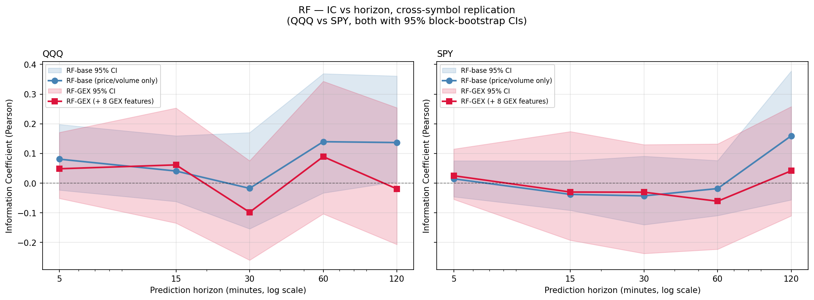
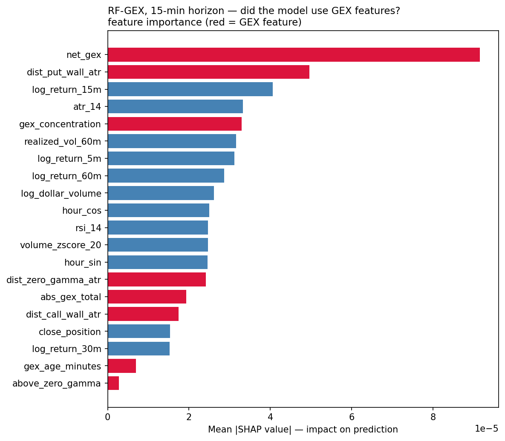
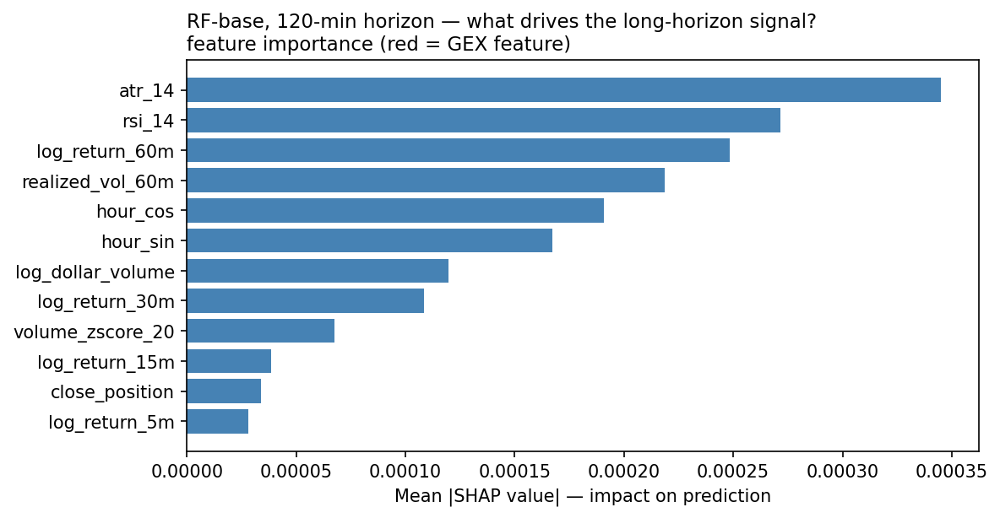
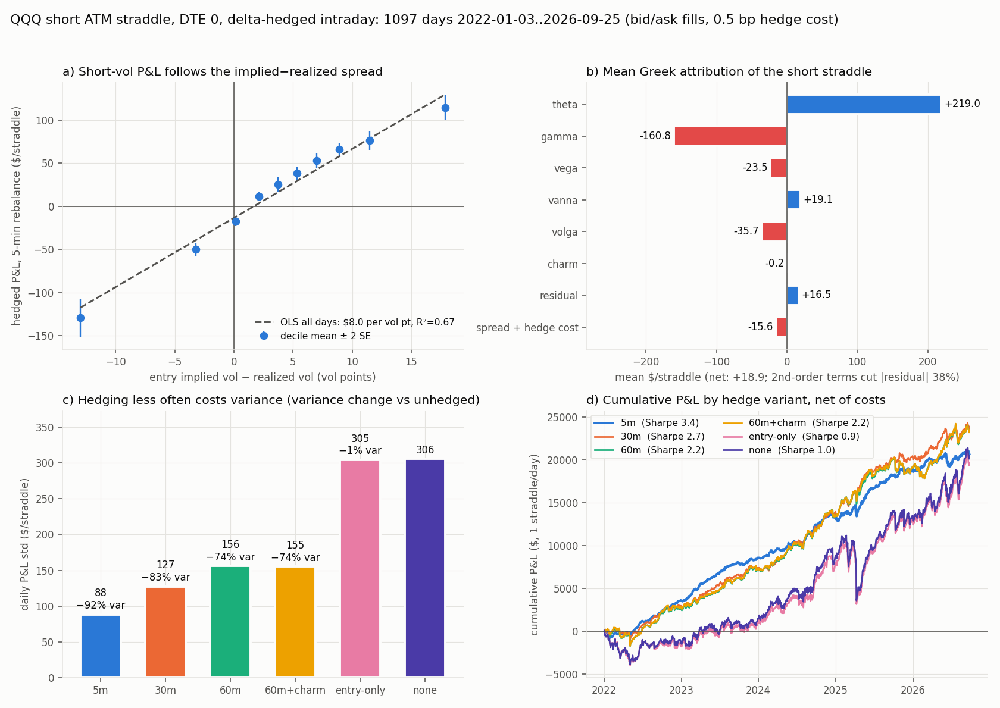
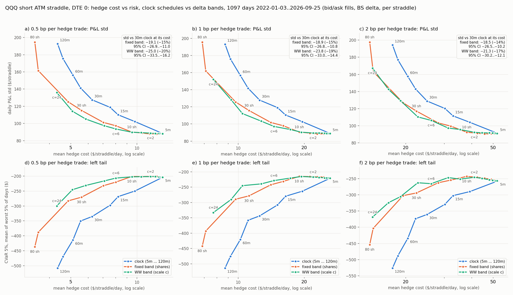
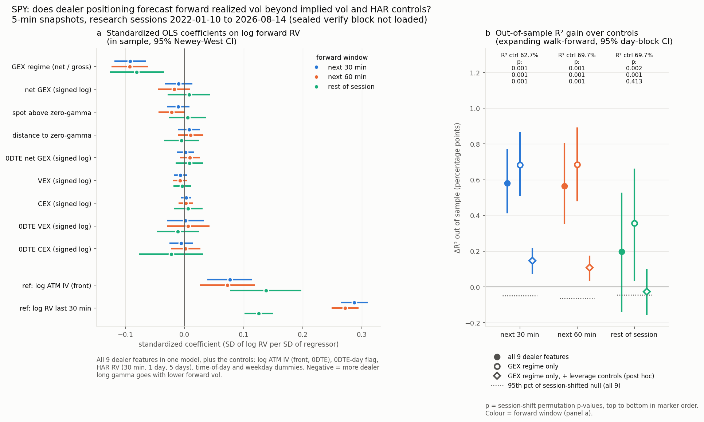

# Do Dealer-Hedging Flows Improve Short-Horizon Index-ETF Return Prediction?

A walk-forward study of whether gamma exposure (GEX) features extracted from real-time
options data improve forward-return prediction over a price-and-volume baseline. Evaluated
across **two index ETFs** (QQQ = Nasdaq-100, SPY = S&P 500), five horizons (5 min – 120 min),
and two model architectures (Random Forest, FT-Transformer).

**TL;DR.** Across 2 underlyings × 5 horizons × 2 architectures (≈170 model fits total),
the GEX-vs-baseline question has a **mixed answer that depends on horizon and architecture**:

- **At short horizons (5–30 min)**, GEX features (with wall-strength weighting) give *marginally
  positive* ΔIC on both QQQ and SPY — small (≤+0.03 IC) and within block-bootstrap CIs, but
  consistently signed in the predicted direction.
- **At long horizons (60–120 min)**, GEX features *hurt* both architectures on both
  underlyings. The baseline alone achieves **IC = +0.137 (QQQ) / +0.160 (SPY) at 120-min**,
  with **65.8% / 62.1% directional accuracy** — and adding GEX strictly degrades it.
- **FT-Transformer uniformly degrades with GEX** across all four tested configurations
  (QQQ and SPY × 15-min and 60-min): ΔIC ranges from −0.044 to −0.177, with extreme
  fold-level variance. An earlier single run showed a spurious +0.019 on SPY @ 60-min
  that did not replicate — consistent with FT-T's instability on ~450-row training folds.

SHAP shows wall-strength features (added after the original 8 GEX features) **rank #2 and
#3 in importance**, validating that the model treats wall importance as central. SHAP
dependence reveals the model has learned a partial "resistance-rejection" pattern at the
call wall (cleanly on SPY) and an "anti-reversal / failed-support" pattern at the put wall
(both underlyings). The patchy, partly-correct, partly-opposite-of-theory pattern is
exactly what's expected when a model with limited data tries to fit microstructure
features that have small effects.

---

## 1. Research question

The microstructure literature suggests dealer hedging of net-short options positions
*amplifies* moves below the zero-gamma flip and *suppresses* them above it. If true, this
would imply that observable proxies for dealer gamma exposure — call walls, put walls,
zero-gamma strike, total |GEX| — should carry incremental predictive value for short-horizon
index returns *beyond* what is already captured by price and volume features.

We test this on **two major index ETFs** — QQQ (Nasdaq-100) and SPY (S&P 500), each with
its own real-time options chain ingestion — over an overlapping three-week May-2026 sample.
SPY is the cross-symbol replication: if the QQQ finding holds on a structurally similar but
distinct underlying, the result generalizes; if it does not, the result is symbol-specific.

## 2. Data pipeline

The dataset is novel because **historical GEX is not commercially available at affordable
prices** — most providers gate it behind paid plans (Polygon, ORATS, OptionMetrics) or
offer only current snapshots (FlashAlpha free tier). Instead, this project's existing Azure
Functions cron (`ScheduledGammaExposure`) computes Black-Scholes gamma exposure every 5 min
from yfinance option-chain snapshots for *both* QQQ and SPY underlyings, and stores both
per-strike `gamma_levels` and aggregate `gamma_exposure` metadata into Postgres.

| Coverage          | QQQ                  | SPY                  |
|-------------------|----------------------|----------------------|
| 5-min bars        | 1944                 | 2886                 |
| GEX snapshots     | 2126 (~88/hour, 24/7) | 2121 (~88/hour, 24/7) |
| Labeled levels    | ~18 200              | ~18 200              |
| Sample window     | 2026-04-24 → 2026-05-15 | 2026-04-24 → 2026-05-15 |

The pipeline ([`build_dataset.py`](build_dataset.py)) performs an as-of join — for each bar
at time *t*, it pairs the most recent GEX snapshot satisfying `computed_at ≤ t` and
`t − computed_at ≤ 15 min`. Three explicit leakage assertions guard the join:

```
assert (final.computed_at <= final.date).all()
assert (final.target_time > final.date).all()
assert (final.target_time - final.date == horizon_min).all()
```

Output per horizon: ~770–1120 rows × 22 features after rolling-warmup and session-boundary
target drops.

## 3. Features

12 baseline (price/volume/microstructure/time) + 10 GEX (dealer-flow proxies). The two
most redundant time features (`minutes_since_open`, `close_vs_sma20`) were dropped after
EDA exposed |corr| > 0.85 with other features.

| Group       | Features |
|-------------|----------|
| Returns     | `log_return_{5,15,30,60}m` |
| Volatility  | `realized_vol_60m`, `atr_14` |
| Volume      | `volume_zscore_20`, `log_dollar_volume` |
| Bar shape   | `close_position` |
| Trend       | `rsi_14` |
| Time-of-day | `hour_sin`, `hour_cos` |
| **GEX — distance and regime** (`with-GEX` variant) | `dist_{call_wall,put_wall,zero_gamma}_atr`, `above_zero_gamma`, `net_gex`, `abs_gex_total`, `gex_concentration`, `gex_age_minutes` |
| **GEX — wall strength** (added after first round) | `call_wall_strength`, `put_wall_strength` (each = `|gex@wall_strike| / abs_gex_total`, in [0,1]) |

GEX distances are normalized by ATR(14) so the model sees "how many volatility units away
is the wall" rather than an absolute dollar distance. The **wall-strength** features let
the tree condition on *how important* a wall is (fraction of total dealer gamma
concentrated at that strike) rather than treating all walls equally — a refinement added
after the first SHAP dependence analysis suggested the model was using walls without regard
to their relative size.

## 4. Models

Two architecturally distinct estimators, picked to span the tabular ML spectrum:

- **Random Forest** (`sklearn.ensemble.RandomForestRegressor`): 500 trees,
  `min_samples_leaf=10`, `max_features='sqrt'`, no max-depth limit. Chosen for its
  out-of-box resistance to overfitting on small noisy datasets.
- **FT-Transformer** (Gorishniy et al. 2021,
  [`rtdl-revisiting-models`](https://github.com/yandex-research/rtdl)): attention applied to
  per-feature embeddings (the modern "deep learning for tabular data" reference). Configured
  with `n_blocks=2`, `d_block=96`, `attention_dropout=0.2`, `ffn_dropout=0.1` — heavier
  regularization than the paper defaults given our small training folds. AdamW with
  `weight_decay=1e-5`, early stopping on the last 15% of each training fold (`patience=20`,
  max 200 epochs).

Both models train under the same walk-forward harness with identical fold splits; only the
estimator class changes.

## 5. Evaluation

Three layers, each answering a different question:

```
[ research: walk-forward folds (purged + embargoed) ][ 1-week gap ][ verify: scored once ]
```

**Walk-forward CV** ([`eval.py`](eval.py) `walk_forward`, default `split="sessions"`):
5 expanding-window folds cut on **trading-session boundaries**. Each test fold is
`n_sessions // 6` sessions; training uses every earlier session except the one
immediately before the test block (**embargo**). Because `compute_target` never lets a
target cross a session, session-aligned cuts leave no label overlap; a purge step and an
assertion (`train.target_time.max() < test.date.min()`) enforce it anyway.

> Sections 6.1–6.7 were produced with the earlier `split="rows"` harness
> (`TimeSeriesSplit(n_splits=5, test_size=100)`, 500 OOS rows). It cut folds mid-session, so
> the last `horizon` training targets overlapped each test fold. It is kept for
> reproducibility. On the Sept-2026 QQQ 15-min research set, switching to session folds
> moved RF-base IC from −0.058 to +0.017 and ΔIC(GEX) from +0.054 to +0.016, with 3,839
> OOS rows instead of 500 and CIs about half as wide.

**Sealed verify set** ([`holdout.py`](holdout.py)): everything from `VERIFY_START`
(2026-08-24) on is verify data, and the 5 sessions before it are dropped as a one-week gap.
All training/SHAP scripts load data through `load_research`, which never returns verify
rows. [`final_verify.py`](final_verify.py) fits once on all research data, scores verify,
and appends the result to `data/verify_log.jsonl`. It refuses to re-score a config it
has already scored unless you pass `--force`, and it prints how many times that
symbol/horizon has been looked at.

**GEX null test** ([`null_test.py`](null_test.py)): answers whether *aligned* GEX beats GEX
taken from the wrong days. The whole GEX feature block is circularly rolled by every whole-session
shift from 5 to `n_sessions − 5` (an exact permutation distribution, one run each) and
RF-GEX is refit. The p-value is the share of shifted runs whose ΔIC over RF-base is at least
the real ΔIC. The shift keeps GEX's own distribution and autocorrelation, so the test
separates "GEX information" from "extra GEX-shaped columns".

| 15-min, research set (78 sessions, 69 shifts) | real ΔIC | null median | null 90% range | p |
|---|---|---|---|---|
| QQQ | +0.0084 | −0.0008 | [−0.034, +0.031] | 0.34 |
| SPY | +0.0054 | −0.0127 | [−0.045, +0.012] | 0.13 |

At 15 minutes, neither symbol's real GEX beats GEX shifted to the wrong days: the small
positive ΔIC is within what misaligned GEX earns by chance ([`plots/gex_null_qqq_h3.png`](plots/gex_null_qqq_h3.png),
[`plots/gex_null_spy_h3.png`](plots/gex_null_spy_h3.png)). With 69 shifts the smallest
possible p is 1/70 ≈ 0.014.

Metrics:

- **Information Coefficient (Pearson and Spearman)** between predictions and realized
  forward returns — the finance-standard regression metric.
- **95% confidence intervals** via stationary **block bootstrap** with block size 73 (≈ one
  full RTH session at the 5-min grid), 1000 resamples. Block bootstrap is necessary because
  consecutive bars are autocorrelated; vanilla bootstrap would underestimate the CI width.
- **Directional accuracy** = `mean(sign(prediction) == sign(realized return))`.

The block-bootstrap CI was the single most informative metric for interpreting these
results, given the small-sample regime — every IC point estimate must be read alongside its
interval.

## 6. Results

### 6.1 Headline grid (15-minute horizon, QQQ)

|                  | Without GEX (12 feat) | With GEX (23 feat) | Δ            |
|------------------|-----------------------|---------------------|--------------|
| **Random Forest** | IC = +0.041 / dir 56.6% | IC = **+0.062** / dir 54.8% | ΔIC = **+0.021** |
| **FT-Transformer** | IC = +0.022 CI[−0.086,+0.187] / dir 55.4% | IC = −0.060 / dir 52.4% | ΔIC = −0.082 |

The RF flips to a *marginally positive* GEX effect when wall-strength features are
included (was −0.007 with the 8-feature GEX set). FT-T is hurt by the larger feature
count — consistent with neural architectures' steeper per-feature data cost. All IC 95%
CIs straddle zero, so claims of significance are not made.

### 6.2 Multi-horizon sweep — QQQ

| Horizon | n_total | RF-base IC | RF-GEX IC | Δ(IC) | RF-base dir-acc | RF-base 95% CI |
|---------|---------|------------|-----------|-------|------------------|---------------------|
| 5 min   | 1124    | +0.081     | +0.048    | −0.033| 50.5%            | [−0.023, +0.198]    |
| **15 min** | **1095** | +0.041     | **+0.062** | **+0.021** | 54.8% | [−0.062, +0.160]    |
| 30 min  | 1047    | −0.018     | −0.098    | −0.081| 56.3%            | [−0.154, +0.171]    |
| 60 min  | 954     | +0.140     | +0.089    | −0.050| 62.2%            | [−0.033, +0.369]    |
| **120 min** | **772** | **+0.137** | −0.019 | −0.156 | **65.6%** | **[+0.005, +0.361]** |

Two observations on QQQ:

1. **Mixed GEX effect by horizon.** ΔIC is positive at 15-min (+0.021) but negative at all
   other horizons, with the strongest *worsening* at 120-min (−0.156). Adding GEX features
   helps where the price/volume baseline is weakest, but degrades where the baseline is
   strongest — consistent with feature count adding noise when the underlying signal-to-
   noise ratio is already high.
2. **The baseline carries genuine long-horizon signal.** At 120-min the RF-base bootstrap CI
   excludes zero, with 65.6% directional accuracy — a 9-point edge over the 56.6%
   "always-predict-up" baseline rate observed in the period.

### 6.3 Cross-symbol replication — SPY



| Horizon | n_total | RF-base IC | RF-GEX IC | Δ(IC) | RF-base dir-acc | RF-base 95% CI |
|---------|---------|------------|-----------|-------|------------------|---------------------|
| 5 min   | 1013    | +0.015     | +0.025    | **+0.010** | 51.3%       | [−0.046, +0.075]    |
| 15 min  | 982     | −0.038     | −0.030    | **+0.008** | 52.3%       | [−0.092, +0.075]    |
| 30 min  | 940     | −0.043     | −0.031    | **+0.012** | 55.4%       | [−0.140, +0.091]    |
| 60 min  | 853     | −0.018     | −0.061    | −0.043| 52.5%            | [−0.109, +0.076]    |
| **120 min** | **691** | **+0.160** | +0.042 | −0.118 | **62.1%** | [−0.057, +0.378]    |

Three observations on the cross-symbol comparison:

1. **The 120-minute baseline result replicates and *strengthens* on SPY** — IC = +0.160
   (vs QQQ's +0.137), dir-acc 62.1%. This is the most important replication: a *real signal*
   at 120-min on two distinct underlyings.
2. **The long-horizon GEX null replicates** — ΔIC at 60–120 min is negative on both QQQ
   (−0.050 and −0.156) and SPY (−0.043 and −0.118), and gets *worse* with wall-strength
   features added.
3. **At short horizons (5–30 min), SPY shows *consistently positive* ΔIC** (+0.008 to
   +0.012) — small and within block-bootstrap CIs, but uniformly signed in the predicted
   direction across three independent horizons. The QQQ short-horizon picture is mixed
   (+0.021 at 15-min, negative elsewhere). The cross-symbol divergence at short horizons
   hints at underlying-specific microstructure that would warrant follow-up at larger
   sample sizes.

### 6.4 FT-Transformer results — QQQ and SPY × 15-min and 60-min

| Symbol | Horizon | FT-T-base IC | 95% CI | FT-T-GEX IC | ΔIC |
|--------|---------|-------------|--------|------------|-----|
| QQQ | 15 min | +0.022 | [−0.086, +0.187] | −0.060 | −0.082 |
| QQQ | 60 min | +0.061 | [−0.094, +0.260] | −0.116 | −0.177 |
| SPY | 15 min | −0.020 | [−0.073, +0.095] | −0.101 | −0.081 |
| SPY | 60 min | +0.027 | [−0.099, +0.153] | −0.017 | −0.044 |

**GEX hurts FT-T uniformly across all four configurations.** ΔIC is negative in every
cell, ranging from −0.044 (SPY 60-min, smallest) to −0.177 (QQQ 60-min, largest). The
fold-level variance for FT-T-GEX is extreme throughout — e.g., SPY 60-min folds: +0.125,
**+0.567**, −0.246, −0.226, +0.210 — showing that a single favorable fold can dominate
the aggregate IC at this sample size.

An earlier run produced FT-T-GEX IC = +0.046 on SPY 60-min (ΔIC = +0.019), appearing to
be "the only positive GEX effect for any FT-T variant." That result did not replicate on
re-run (−0.017); it was within the expected variance of a model that swings ±0.5 IC
across folds on ~450-row training sets. The conclusion stands: **FT-T does not extract
reliable signal from GEX features at this data scale.** The instability is the finding —
it is consistent with the known property that attention-based models have steeper
per-feature data cost than tree ensembles, requiring substantially more training rows
before attention patterns can stabilize.

For reference, the RF results at the same two horizons:

| Symbol | Horizon | RF-base IC | RF-GEX IC | ΔIC |
|--------|---------|-----------|----------|-----|
| QQQ | 15 min | +0.041 | +0.062 | +0.021 |
| QQQ | 60 min | +0.140 | +0.089 | −0.050 |
| SPY | 15 min | −0.038 | −0.030 | +0.008 |
| SPY | 60 min | −0.018 | −0.061 | −0.043 |

The RF shows marginally positive ΔIC at 15-min on both symbols — the only horizon where
GEX adds value on the tree model — while FT-T is negative at 15-min too. This suggests
the short-horizon GEX signal (if real) requires implicit regularization to surface: the
RF's bagging + min-leaf constraint filters noise that FT-T's attention overfits.

### 6.5 SHAP attribution (QQQ)

**Did the tree model *use* GEX features when they were available?** Yes — overwhelmingly.
The top 3 features by mean |SHAP value| are all GEX:



```
Rank   Feature                mean|SHAP|     Type
  1    net_gex                0.000074       GEX
  2    put_wall_strength      0.000057       GEX
  3    call_wall_strength     0.000052       GEX
  4    log_return_15m         0.000043       baseline
  5    dist_put_wall_atr      0.000043       GEX
```

The two **wall-strength** features (added specifically as a refinement after the original
SHAP analysis) immediately landed in the #2 and #3 importance slots — confirming that the
model treats *wall importance* as nearly as central as `net_gex`. The interpretation
therefore is not "GEX is informationally useless" but rather: **the tree prioritizes GEX
features, and properly weighting walls by their relative GEX magnitude reinforces this
prioritization. The mixed prediction-quality outcomes downstream (small ΔIC at short
horizons, negative at long horizons) reflect signal-vs-noise tradeoffs from feature-count
inflation, not feature irrelevance.**

### 6.6 What did the model *learn* at GEX levels? — SHAP dependence

**Question:** does the model encode the textbook "reversal-at-walls" microstructure
hypothesis (price gets rejected at call wall = resistance; bounces off put wall = support),
or something else?

Method: for each of the four key signed GEX features, plot mean |SHAP value| vs feature
value across all held-out predictions. The shape tells the story:

- monotonically *decreasing* line below 0 → reversal toward the level
- discontinuity at 0 → distinct behavior on each side of the level
- monotonically *increasing* line → trend / breakout
- flat / scattered → no coherent use

**Findings:**

| Feature × Symbol | Shape | Encodes …                               | Matches reversal hypothesis? |
|---|---|---|---|
| QQQ call wall | reversal below, breakout above (sharp discontinuity at x=0) | *partial* "resistance-until-broken" | partial |
| SPY call wall | clean negative-sloped curve, peak −5 ATR from wall | "resistance rejection" — the cleanest reversal pattern in the study | **yes** |
| QQQ put wall | strong negative SHAP near wall, positive far above | **failed-support / break-through** (opposite of theory) | no |
| SPY put wall | same shape as QQQ, more pronounced | **failed-support / break-through** | no |
| QQQ zero gamma | non-monotonic oscillation | no coherent pattern | — |
| SPY zero gamma | monotonic increase | likely period-drift artifact, not suppression effect | no |

The model has learned **partial and inconsistent reversal logic**: clean reversal-at-call-
wall on SPY (the strongest single GEX-feature signal in the study), partial on QQQ, and
the *opposite* of the reversal hypothesis at the put wall on both underlyings. Zero-gamma
is either noise or drift-confounded.

This is exactly the patchy, partly-real partly-noise pattern expected from a model in the
small-sample regime: some features got a coherent (and plausible) microstructure signal,
others got the opposite of theory, and one got drift-confounded. **It is consistent with
and strengthens the writeup's central claim** — the GEX features carry *some* signal, but
the model cannot reliably extract the *right* version of it at n ≈ 600.

### 6.7 Long-horizon baseline attribution

For the strongest result (RF-base at 120-min), SHAP attributes the IC primarily to
volatility regime features:



```
1.  atr_14            mean|SHAP| = 0.000345
2.  rsi_14                       = 0.000272
3.  log_return_60m               = 0.000249
4.  realized_vol_60m             = 0.000219
5.  hour_cos                     = 0.000191
```

Short return lags (`log_return_5m`, `log_return_15m`) rank dead last — consistent with the
finding that short-horizon noise does not help predict 2-hour returns.

### 6.8 Delta-hedged straddle study

A companion study on the dealer side of the trade. It uses the same ThetaData backfill: real
5-minute QQQ/SPY option quotes from 2022-01-03 to 2026-09-25.

**Method** (`delta_hedge.py`, Greeks in `greeks.py`):
- **Trade.** Each day, sell one ATM straddle (×100) at the 09:35 bid. Buy it back at the 16:00
  ask, or settle at intrinsic on 0DTE.
- **Hedge.** Hedge with shares every 5 min, every 30 min, every 60 min, every 60 min with a
  charm pre-shift, once at entry, or never. Each hedge trade costs 0.5 bp.
- **Smile delta.** The 5m and 60m schedules are also run with the Hull & White (2017)
  minimum-variance delta, Δ_BS + vega·β/(S√T). β is the slope of the strike's IV change on
  dS/(S√T), fitted only on the prior 60 days, so it is out of sample. The adjustment is off in
  the last hour, where IV has no linear relation to spot.
- **IV.** Each leg's IV is re-implied from its own mid on a calendar clock to the 16:00 expiry.
  ThetaData's own IV floors T at about 1 h, which misprices the last hour of a 0DTE.
- **Attribution.** Each bar's P&L is attributed with Greeks from the start of the bar:
  - first order: delta mismatch, gamma ½ΓdS², theta Θdt, vega νdσ;
  - second order: vanna dS·dσ, volga ½dσ², charm dt·dS;
  - residual: whatever is left.
- **Theory check.** Hedged P&L is compared with ½ΓS²(σ²_imp dt − r²).



| | QQQ 0DTE | SPY 0DTE | QQQ 1DTE* | SPY 1DTE* |
|---|---|---|---|---|
| days | 1,097 | 1,097 | 1,178 | 1,178 |
| mean premium ($/straddle) | 369 | 318 | 612 | 536 |
| 5-min hedged P&L, net of costs | **+$18.9 (5.5%)** | **+$13.3 (4.2%)** | −$7.0 (−0.6%) | −$2.7 (−0.6%) |
| annualized Sharpe (5-min) | 3.4 | 2.7 | −1.3 | −0.6 |
| mean entry IV − realized (vol pts) | +4.0 | +3.0 | −8.9 | −6.5 |
| R², P&L vs ½ΓS²(σ²_imp − σ²_real) | 0.49 | 0.51 | 0.33 | 0.36 |
| variance cut vs unhedged: 5m / 30m / 60m | 92 / 83 / 74% | 91 / 84 / 73% | 85 / 76 / 67% | 85 / 78 / 68% |
| 60m + charm pre-shift | 74.3% | 73.4% | 67.0% | 67.7% |
| variance of smile delta vs BS delta: 5m / 60m | −1.4 / −4.0% | +1.7 / −2.7% | −2.5 / −1.1% | −3.2 / −3.6% |
| worst day, 5-min hedged / unhedged ($) | −862 / −3,451 | −1,029 / −3,314 | −819 / −3,102 | −842 / −2,870 |
| skewness, 5-min hedged / unhedged | −1.5 / −2.8 | −2.7 / −3.1 | −3.0 / −4.9 | −2.8 / −5.2 |
| CVaR 5%, 5-min hedged / unhedged ($) | −204 / −847 | −181 / −714 | −276 / −717 | −216 / −590 |
| max drawdown, 5-min hedged ($) | 1,569 | 1,442 | 10,685 | 6,239 |
| \|residual\| cut by 2nd-order terms (daily / per bar) | 38 / 16% | 22 / 15% | 83 / 46% | 75 / 48% |

\* 1DTE is held intraday only. A calendar-clock IV spreads overnight and weekend variance over
24 h, so intraday realized vol runs above it. The negative IV − RV is therefore a clock effect,
not a missing variance risk premium.

What it shows:
- **The variance risk premium is real on 0DTE and survives costs.** Implied beats realized by
  3–4 vol points on average. The hedged short straddle keeps 4–6% of premium after bid/ask and
  hedge costs, and P&L lines up with the implied − realized spread (panel a).
- **Hedge frequency is a variance-vs-cost trade.** Hourly hedging keeps about 80% of the
  5-minute variance reduction and costs half as much ($7.6 vs $15.6 per straddle on QQQ). Its
  mean P&L is higher, but so is its std.
- **Second-order Greeks matter most away from expiry.** Vanna and volga remove 75–83% of the
  unexplained daily P&L on 1DTE, but only 22–38% on 0DTE. In the last hour of a 0DTE, IV swings
  10+ points with minutes left and the Taylor expansion in σ stops converging.
- **The charm pre-shift barely helps, contrary to the prior.** It moves hourly hedging's
  variance cut by only 0.1–0.3 points, even on 0DTE. Charm is delta decay at a fixed spot. On a
  random-walk path, spot moving through a convex delta cancels most of that decay, so the
  pre-shift only pays when spot stays pinned (realized < implied). `test_delta_hedge.py` has a
  synthetic test for each case.
- **The smile delta helps a little, but not significantly.** Out-of-sample β is consistently
  negative: index IV falls as spot rises, with median β between −0.06 and −0.08. The smile delta
  cuts variance by 1–4% in 7 of 8 configurations. No 95% block-bootstrap CI on the variance
  ratio excludes 1, though. At 5-minute resolution spot explains only about 4% of IV moves (bar
  correlation about −0.2), so there is little spot-driven vega to hedge. It also gives back
  $100–400 per straddle on the April 7–9 2025 tariff days, when IV moved non-linearly with spot.
- **Hedging cuts the left tail, and short vol stays negatively skewed.** 5-minute hedging
  shrinks the QQQ 0DTE worst day from −$3,451 to −$862 and 5% CVaR from −$847 to −$204.
  Skewness remains −1.5. The worst day, 2025-04-07 (IV 148% vs realized 256%), equals about 46
  average days of P&L. The hedged book made money through 2022 and was flat in April 2025, when
  the unhedged straddle lost $4.5k.

Caveats: RISK_FREE_RATE is a constant 5%. Deep-ITM legs are quoted wide, which adds mark noise
to the residual. NYSE half days are skipped. Only aggregates are plotted or tabulated, per the
ThetaData license.

#### Delta bands vs clock hedging: the cost-vs-risk frontier

A clock hedges on a timer, whether or not the delta moved. A band hedges on the state: it
checks every 5-minute bar and trades back to the target delta only when the hedge has drifted
by more than a set number of shares (`delta_hedge.py --frontier`). Two band families are
compared against clocks of 5 to 120 minutes:
- **Fixed bands** of 1 to 80 shares per straddle.
- **Whalley–Wilmott-shaped bands**, with half-width c·(3/2·κ·S·(100Γ)²)^(1/3), where κ is the
  cost in bp/1e4. The band widens with cost and narrows where gamma is low. The free scale c
  stands in for risk aversion, so this is a WW-shaped heuristic, not the utility optimum.

For each schedule the study records mean hedge cost ($/straddle/day), daily P&L std and CVaR 5%,
at 0.5, 1 and 2 bp per hedge trade. Each band family is compared with the clock frontier at the
same cost, interpolated linearly in log cost. CIs come from a paired 20-day moving-block
bootstrap (2,000 draws, re-interpolated in every draw). The existing variants reproduce exactly.



Std change of the band frontier vs the clock frontier, at the 30-minute clock's cost (0.5 bp;
95% CI):

| | QQQ 0DTE | SPY 0DTE | QQQ 1DTE | SPY 1DTE |
|---|---|---|---|---|
| fixed band | **−15%** [−21, −9] | −10% [−21, +3] | **−13%** [−17, −9] | **−8%** [−14, −2] |
| WW band | **−20%** [−26, −13] | **−18%** [−27, −9] | **−14%** [−19, −9] | **−11%** [−16, −5] |
| WW − fixed ($ std) | **−5.9** [−9.3, −2.9] | **−8.3** [−13.2, −3.8] | −1.1 [−3.4, +1.1] | **−2.6** [−4.2, −1.1] |

What it shows:
- **Bands beat clocks at equal cost.** At the cost of the 30-minute clock, a band cuts daily
  P&L std by 8–20%. The CI excludes 0 in every family × config × cost cell except fixed bands
  on SPY 0DTE (−10%, p ≈ 0.13 at all three costs). There the WW band is significant (−18%). At the 15-minute clock's cost the cut is 5–15%, and at
  the 60-minute clock's cost it is 20–29%.
- **Bands also cut the tail.** At equal cost, the band frontier's CVaR 5% is better than the
  clock's at every band width. For example, on QQQ 0DTE at 1 bp a 20-share band has
  $79/straddle less CVaR than a clock of the same cost.
- **Mean P&L also improves.** On QQQ 0DTE at 0.5 bp, a 10-share band makes 20 trades a day for
  $9.5 of cost. It has the same std as the 5-minute clock ($90 vs $88), but earns +$24.0 vs
  +$18.9, and its Sharpe is 4.2 vs 3.4.
- **Scaling the band with gamma pays on 0DTE.** WW beats fixed bands by 2–8% of std on 0DTE,
  where gamma swings the most during the day. On QQQ 1DTE the difference is not significant.
- **The cost level mostly moves the frontier along the cost axis.** From 0.5 to 2 bp, the std
  gaps change by less than a dollar. Clocks and fixed bands make the same trades at any cost.
  WW bands widen by κ^(1/3), which moves a given c along the WW curve.
- **Hedging every bar partly chases noise.** A 5-share band has slightly lower std than the
  5-minute clock (QQQ 0DTE $87.8 vs $88.1) and costs less. On GBM that cannot happen, so part
  of each 5-minute delta change on real data is noise the clock pays to trade. The synthetic
  GBM gap at the 30-minute cost (9–15%) is similar in size to the real one, though.

Caveats:
- The clock frontier is bumpy. Interpolating a clock from its neighbours misses by $3–8, and
  the 60-minute clock sits above the line, so the gaps at the 60-minute cost overstate the band
  advantage. The 30-minute cost, used above, is the conservative anchor. It was fixed before
  the runs.
- Bands trade back to the target delta. True Whalley–Wilmott trades only to the band edge,
  which is cheaper; edge hedging is the natural next variant.
- The frontier hedges with plain BS delta, with no smile or charm shift.
- The bootstrap tests are correlated across bands and costs, and no multiple-testing
  correction was applied.

**Dealer vanna and charm exposure.** `thetadata_gex.py` now writes `net_vex` =
Σ vanna·OI·100·spot·sign and `net_cex` = Σ charm·OI·100·sign next to GEX, plus 0DTE splits.
The sign convention matches GEX (calls +, puts −). These sums cover the whole chain in the
window, while GEX sums only the key levels. `build_dataset.py` turns them into signed-log
features (`vex_signed_log`, `cex_signed_log`, …). They are NaN for older snapshot files and the
DB source, and they are not yet in any model's feature list. Adding them to the live
calculator and DB is a follow-up.

### 6.9 Does dealer positioning forecast realized volatility?

The return-prediction results above are mostly null. The textbook dealer-hedging claim,
though, is about volatility, not direction:
- when dealers are long gamma, they sell rallies and buy dips, which damps moves;
- when they are short gamma, they chase moves, which amplifies them.

`gex_vol_study.py` tests this directly on the ThetaData snapshots, which were regenerated with
VEX/CEX. Every existing GEX column was verified bit-identical to the old files.

**Setup**
- **Target.** Log realized variance of the underlying over the next 30 min, the next 60 min,
  and the rest of the session. It is built from 5-minute Databento bars that start at or after
  the snapshot time. The first bar uses its own open→close, so no price at or before t enters
  the target. Features use only data up to t. 30m and 60m windows must be complete and must
  not cross a session boundary.
- **Controls that must be beaten:**
  - log ATM IV (the front DTE ≥ 1 expiry, and 0DTE) and a 0DTE-day flag;
  - HAR log RV over the last 30 min, the previous session and the previous 5 sessions;
  - time-of-day and weekday dummies.
- **Dealer block (9 features):**
  - GEX regime (net/gross GEX at the key levels) and signed-log net GEX;
  - above/below zero-gamma and the distance to it, as a % of spot;
  - 0DTE net GEX;
  - VEX and CEX signed logs, whole chain and 0DTE.
- **Method.** OLS with a 10-fold expanding walk-forward over sessions, with a 1-session purge
  and embargo. The statistic is the out-of-sample R² gain of the dealer block over the
  controls.
  - CIs: 5-day block bootstrap.
  - Null: shift the dealer block by whole sessions against the targets, as in `null_test.py`,
    using all ~1,150 shifts.
  - Coefficients: Newey-West errors with 78 or 156 lags, because the targets overlap.
- **Holdout.** Only research sessions are read, 2022-01-10 → 2026-08-14 (1,152 days, 76–89k
  rows per symbol and horizon). The session list comes from partition names alone, the same cut as
  `holdout.split_holdout`. Every read is filtered before the cutoff, and asserts check this.
  The sealed verify block is never loaded.
- **Spec.** It was fixed in the docstring before the first out-of-sample run. The leverage
  controls below were added afterwards and are labelled post-hoc.



Out-of-sample R² gain over the controls, in percentage points (95% CI; session-shift p):

| | R², controls only | all 9 dealer features | GEX regime only | GEX regime, + leverage controls (post-hoc) |
|---|---|---|---|---|
| QQQ next 30m | 62.4% | +0.51 [0.34, 0.67] | +0.62 [0.46, 0.77] | +0.06 [0.01, 0.10] p=.001 |
| QQQ next 60m | 69.4% | +0.42 [0.23, 0.61] | +0.60 [0.42, 0.77] | −0.00, p=.14 |
| QQQ rest of session | 69.0% | +0.46 [0.15, 0.79] | +0.51 [0.22, 0.81] | +0.07 [−0.05, 0.17] p=.03 |
| SPY next 30m | 62.7% | +0.58 [0.41, 0.77] | +0.68 [0.51, 0.87] | +0.15 [0.07, 0.22] p=.001 |
| SPY next 60m | 69.7% | +0.57 [0.35, 0.81] | +0.68 [0.48, 0.89] | +0.11 [0.03, 0.18] p=.001 |
| SPY rest of session | 69.7% | +0.20 [−0.14, 0.53] | +0.36 [0.04, 0.66] | −0.03, p=.41 |

In the pre-declared spec every p is ≤ 0.002. GEX regime alone has a positive gain in 9–10 of 10
folds, except SPY rest of session (6/10).

What it shows:
- **The sign is the one dealer-hedging predicts.** GEX regime has a standardized coefficient
  of −0.06 to −0.09 in all six cells (Newey-West t from −3.5 to −6.8): more dealer long gamma
  goes with lower forward realized vol. It is the only dealer feature with a consistent
  effect.
- **It is small next to the controls.** Implied vol and recent realized vol already explain
  62–70% of log forward RV. GEX adds about 0.5 pp out of sample.
- **Most of it is the leverage effect.** Adding signed recent returns (last 30 min, day, week)
  as controls shrinks the gain to +0.06 to +0.15 pp at 30–60 min, and it is significant mainly
  on SPY. Dealers turn short gamma after sell-offs, and falling markets are volatile whether
  or not dealers hedge. What is left is a small but consistent short-horizon damping effect.
  It is strongest on SPY.
- **VEX and CEX add nothing.** Out of sample, the full 9-feature block does worse than GEX
  regime alone in every cell. The VEX/CEX coefficients have no consistent sign. The one
  exception is QQQ 0DTE VEX (t ≈ +2.5), which SPY doesn't replicate; that is about what chance
  gives across 54 coefficients.
- **The rest-of-session horizon shows nothing robust** once leverage is controlled.

Caveats:
- **OI is from the prior close,** and the dealer sign is naive (dealers long calls, short
  puts). Intraday opening and closing flow, which matters most on 0DTE, is not seen.
- **GEX and VEX/CEX cover different strikes.** GEX sums only the ≤ 8 key-level strikes (call
  wall, put wall, zero-gamma, plus the next strongest). VEX and CEX sum the whole window: the
  nearest 4 expiries within 30 days, with OI > 0.
- **Snapshot Greeks floor T at 1 day** (the live `MIN_T_YEARS`), so 0DTE gamma, vanna and charm
  are those of a 1-day option. ThetaData's own IV floors T at ~1 h, so late-day 0DTE ATM IV
  reads low; the front-expiry IV control is unaffected.
- **The leverage controls were added after seeing out-of-sample results.** The reduced numbers
  are the conservative reading, not a tuned one. With leverage controls the 9-feature null
  sits below 0, because noise regressors cost out-of-sample R². Its p-values therefore mean
  "beats misaligned GEX", not "beats 0".
- **Linear OLS only,** with no quantile regression and no model search. The holdout has not
  been spent on this.

## 7. Discussion

The finding is a **horizon- and architecture-dependent picture, not a clean universal
null**. Three takeaways:

**(1) The long-horizon baseline signal is real and replicates.** RF-base achieves IC =
+0.137 / 65.6% dir-acc on QQQ and IC = +0.160 / 62.1% dir-acc on SPY at 120-min, with
QQQ's bootstrap CI excluding zero. This is *not* a GEX result — it's a price/volume result
— but it's the most rigorous standalone finding in the study and it replicates cleanly
across two distinct underlyings, driven by volatility regime (ATR, realized vol) and
intraday seasonality (per SHAP, Section 6.7).

**(2) GEX features show partial, mixed predictive value.** With wall-strength weighting:
short-horizon ΔIC turns marginally positive on both symbols (largest at QQQ 15-min: +0.021;
SPY at 5/15/30 min all +0.01 range), but long-horizon ΔIC worsens. The model *does* use
GEX features (top 3 SHAP importance), and SHAP dependence shows a clean "resistance-
rejection at call wall" pattern on SPY — exactly what the dealer-hedging theory predicts.
But this signal is too small relative to test-set noise at n ≈ 600 to translate into
consistent held-out IC improvements, especially at long horizons where the baseline
already has good predictability and added features primarily contribute noise.

**(3) FT-Transformer is uniformly hurt by GEX at this data scale.** Across all four
tested configurations (QQQ and SPY × 15-min and 60-min), adding GEX degrades FT-T
(ΔIC from −0.044 to −0.177). The fold-level IC swings up to ±0.5 across training
folds of ~350–900 rows, making single-run aggregate ICs unreliable — an earlier run
produced a spurious +0.019 on SPY 60-min that did not hold on re-run (−0.017). The
architecture finding is therefore: **tree ensembles can extract short-horizon GEX signal
via implicit regularization; transformers cannot at this scale.** This is not surprising
in retrospect — FT-T's per-feature data cost is well documented in the tabular-DL
literature, and GEX features (with their high noise floor and nonlinear interactions)
are exactly the type that benefit more from bagging than attention.

This framing makes two predictions:

1. **The long-horizon GEX null should weaken with more data.** With 6× more training rows
   per fold, the noise floor falls by ~√6 ≈ 2.4×, potentially exposing the ~0.05-effective-
   IC signal that SHAP suggests the model is already detecting.
2. **Feature parameterization matters as much as feature inclusion.** The partial SHAP
   evidence for wall-strength weighting suggests future work should test richer GEX
   parameterizations: per-expiry decomposition, term-structure ratios, charm/vanna
   exposures, and option-flow metrics (PCR, IV skew) once post-migration data accumulates.

## 8. Limitations

- **Sample size.** ~3 weeks of bars; 500 OOS rows in total. The CIs reflect this.
- **Period drift.** The May-2026 sample had P(target > 0) = 0.557; a model that always
  predicts "+" gets ~56% dir-acc on that base rate alone. We benchmark against this
  explicitly.
- **Multiple-comparisons across horizons.** Five horizons were tested; the 120-min CI just
  barely excludes zero on the lower bound (+0.005). After a Bonferroni adjustment for 5
  tests, the result would no longer be marginally significant.
- **Look-ahead bias risk.** Mitigated by three explicit assertions in `build_dataset.py`,
  but cannot be ruled out without an independent audit.
- **GEX feature set is intentionally minimal.** A richer GEX representation (per-expiry
  decomposition, term-structure ratios, charm/vanna exposures) might fare differently — out
  of scope here.

## 9. Reproducibility

```bash
# 1. Setup
cd functions/ml
python3.12 -m venv .venv
.venv/bin/pip install -r requirements.txt

# 2. DB credentials — either DATABASE_URL_DIRECT in local.settings.json
#    or SUPABASE_URL + SUPABASE_SERVICE_ROLE_KEY for REST bypass.

# 3. Build datasets for all 5 horizons, both symbols
for SYM in QQQ SPY; do
  for H in 1 3 6 12 24; do
    .venv/bin/python build_dataset.py --symbol $SYM --horizon-bars $H
  done
done

# 4. Reproduce experiments
.venv/bin/python train_rf.py                                # RF on QQQ at 15-min
.venv/bin/python train_rf_horizons.py --symbol QQQ          # RF QQQ sweep
.venv/bin/python train_rf_horizons.py --symbol SPY          # RF SPY sweep
.venv/bin/python train_ft.py --symbol QQQ --horizon-bars 3  # FT-T QQQ at 15-min
.venv/bin/python train_ft.py --symbol QQQ --horizon-bars 12 # FT-T QQQ at 60-min
.venv/bin/python train_ft.py --symbol SPY --horizon-bars 3  # FT-T SPY at 15-min
.venv/bin/python train_ft.py --symbol SPY --horizon-bars 12 # FT-T SPY at 60-min

# 5. SHAP + horizon plots (per-symbol + cross-symbol)
.venv/bin/python shap_analysis.py
.venv/bin/python plot_horizons.py

# 6. GEX null test (research data only) → plots/gex_null_<sym>_h<h>.png
.venv/bin/python null_test.py --symbol QQQ --horizon-bars 3
.venv/bin/python null_test.py --symbol SPY --horizon-bars 3

# 7. Final exam — run ONCE per frozen config; every run is logged in data/verify_log.jsonl
.venv/bin/python final_verify.py --symbol QQQ --horizon-bars 3

# 8. Delta-hedged straddle study (ThetaData iv_5m) → data/delta_hedge/, plots/delta_hedge_<sym>_dte<d>.png
for SYM in QQQ SPY; do
  for D in 0 1; do
    .venv/bin/python delta_hedge.py --symbol $SYM --dte $D      # --mid, --hedge-cost-bps, --start/--end
    .venv/bin/python plot_delta_hedge.py --symbol $SYM --dte $D
    # cost-vs-risk frontier: clocks vs fixed / WW delta bands → plots/delta_hedge_frontier_<sym>_dte<d>.png
    .venv/bin/python delta_hedge.py --symbol $SYM --dte $D --frontier --costs 0.5,1,2
    .venv/bin/python plot_delta_hedge.py --symbol $SYM --dte $D --frontier
  done
done

# 9. GEX/VEX/CEX vs forward realized vol (research sessions only) → data/gex_vol/, plots/gex_vol_<sym>.png
#    Snapshots must carry net_vex/net_cex: regenerate FULL history (a --start/--end run overwrites the file)
for SYM in QQQ SPY; do
  .venv/bin/python thetadata_gex.py --symbol $SYM
  .venv/bin/python thetadata_gex.py --symbol $SYM --expiries 0dte
done
.venv/bin/python gex_vol_study.py --symbol QQQ --perms 0 --rebuild   # one symbol at a time
.venv/bin/python gex_vol_study.py --symbol SPY --perms 0 --rebuild   # (summary CSV is merged per run)
.venv/bin/python -m unittest test_greeks test_delta_hedge test_thetadata_gex test_gex_vol_study
```

All random seeds fixed to `42`. RF results are deterministic; FT-Transformer results have
small per-run variance due to MPS non-determinism (resolved typically within ±0.005 IC).

## 10. Repository layout

```
functions/ml/
  build_dataset.py        # DB/REST → Parquet, with leakage asserts. --symbol, --horizon-bars.
  eval.py                 # Walk-forward CV + IC + block-bootstrap harness
  train_rf.py             # RF baseline + GEX at single horizon
  train_rf_horizons.py    # RF sweep across 5 horizons (per symbol)
  train_ft.py             # FT-Transformer at configurable symbol/horizon
  shap_analysis.py        # SHAP bar + beeswarm plots for key configs
  shap_dependence.py      # SHAP dependence (what the model learned at GEX levels)
  plot_horizons.py        # IC vs horizon, per-symbol + cross-symbol
  greeks.py               # Vectorized Black-Scholes price + 1st/2nd-order Greeks (vanna, volga, charm)
  thetadata_gex.py        # Historical GEX (+ dealer VEX/CEX) snapshots from the ThetaData backfill
  delta_hedge.py          # Delta-hedged short straddle study with Greek P&L attribution; --frontier: clocks vs delta bands
  plot_delta_hedge.py     # Four-panel summary plot of a delta_hedge.py run; --frontier: cost-vs-risk frontier
  gex_vol_study.py        # Dealer GEX/VEX/CEX vs forward realized vol (walk-forward, session-shift null)
  sync_to_azure.py        # Key-less backup of data/<provider>/ to private Azure Blob
  notebooks/eda.ipynb     # Pre-training exploratory analysis
  plots/                  # Tracked PNGs referenced from this README
  data/                   # Parquets + CSVs (gitignored)
  requirements.txt
```

## 11. Cloud storage

`data/` exists only on this laptop, so paid provider data is backed up to a private
Azure Blob Storage account (`market-research-rg`, `canadacentral`, Standard_LRS, Hot).
It is separate from the storage accounts that back the Azure Functions.

| Container | Holds |
|-----------|-------|
| `databento` | mirror of `data/databento/` (`.dbn.zst`, `.parquet`, `.request.json`, `ledger.jsonl`, audits) |
| `thetadata` | mirror of `data/thetadata/<dataset>/symbol=<SYM>/date=<YYYY-MM-DD>/part.parquet` |

**Key-less auth.** The account has shared-key access and public blob access disabled.
`sync_to_azure.py` authenticates with `DefaultAzureCredential` (your `az login`), which
needs the *Storage Blob Data Contributor* role on the account. No keys, connection strings
or SAS tokens exist anywhere in the repo. The account name is not a secret and is read
from `--account` or `RESEARCH_STORAGE_ACCOUNT`.

```bash
export RESEARCH_STORAGE_ACCOUNT=<account name>   # see: az storage account list -g market-research-rg -o table
.venv/bin/python functions/ml/sync_to_azure.py functions/ml/data/databento databento           # dry run
.venv/bin/python functions/ml/sync_to_azure.py functions/ml/data/databento databento --upload  # new/changed only
.venv/bin/python functions/ml/sync_to_azure.py functions/ml/data/databento databento --verify  # exit 3 on mismatch
.venv/bin/python functions/ml/sync_to_azure.py functions/ml/data/thetadata thetadata --upload
```

Blob names mirror local relative paths. Each blob stores its sha256 as metadata, and
unchanged files are skipped. `manifest.json` (path, size, sha256, mtime) is written at the
local root and uploaded last. Remote blobs are never deleted by the tool, and `*.tmp` or
partial downloads are ignored.

### ThetaData options backfill

`thetadata_fetch.py` downloads the raw inputs for historical GEX: daily open interest
(`oi`, one `expiration="*"` call per day) and 5-minute bid/mid/ask implied volatility with
`underlying_price` (`iv_5m`, one call per expiration with 0–30 DTE, all strikes). Roots are
QQQ, SPY, SPX + SPXW and NDX + NDXP; each root gets its own `symbol=` partition. IV rows for
contracts with zero OI that day are dropped (`--keep-zero-oi` keeps them). Vendor timestamps
are stored untouched, and point-in-time alignment happens later in `build_dataset.py`.

```bash
.venv/bin/python functions/ml/thetadata_fetch.py probe                           # earliest date + permissions per root/job
.venv/bin/python functions/ml/thetadata_fetch.py oi iv_5m                        # dry run: pending partitions
.venv/bin/python functions/ml/thetadata_fetch.py oi iv_5m --download --limit 10  # pilot on the newest days
.venv/bin/python functions/ml/thetadata_fetch.py oi iv_5m --download --workers 2 --max-gb 400
.venv/bin/python functions/ml/sync_to_azure.py functions/ml/data/thetadata thetadata --upload   # periodic backup
```

`probe` caches its table in `data/thetadata/_probe.json`, and `--start` defaults to the probed
earliest date. Downloads run newest first and are resumable: a partition with `part.parquet`
or `_empty` is skipped, and writes go through `part.parquet.tmp`. Each partition appends a line
to `fetch_log.jsonl`, and the end-of-run summary extrapolates hours and GB for the rest.
The script prints only counts, sizes and timings. Exit codes: 0 ok, 1 provider/auth failure,
2 usage, 4 every root denied, 5 disk guard (`--max-gb` or less than 20 GB free).

**ThetaData deletion obligation.** The ThetaData license requires the data to stay private,
never be redistributed, and be deleted, including cloud copies, within 30 days of
cancelling. On cancellation, delete the container and the local copy:

```bash
az storage container delete --account-name "$RESEARCH_STORAGE_ACCOUNT" -n thetadata --auth-mode login
rm -rf functions/ml/data/thetadata
```

Soft delete is not enabled on the account, so the container deletion is final.
